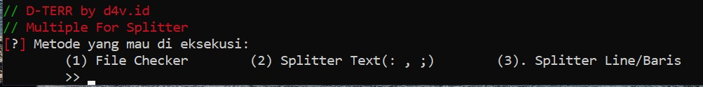
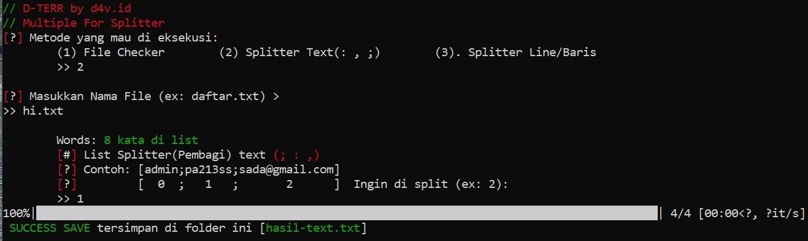
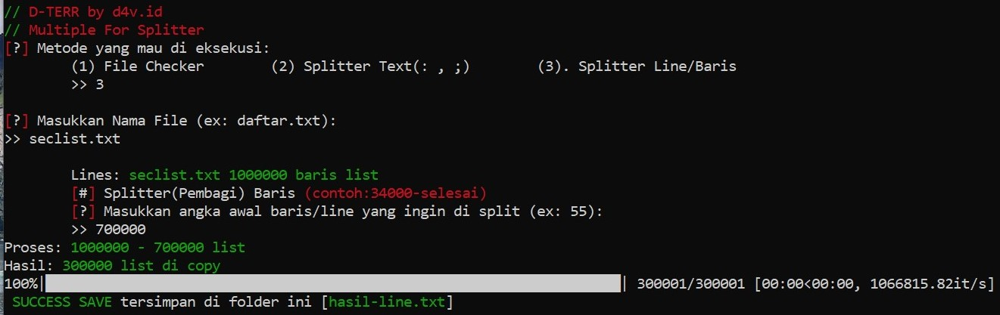

# // (D-TERR) Splitter-List-Line-Text 
<b>ENGLISH</b>
Multiple for Splitter file(List) is a line or character (; : , | #) until it becomes two files and can split of lines, sentences, and words that are in a file "List"

Fitur/Features:
- Split Line
- Split (; : , | #) Character
- Checker File Words,Sentences,lines



# Install
Linux **$**
```bash
 git clone https://github.com/d4v-id/D-TERR-Splitter
 pip install colorama
 pip install tqdm
```
Windows **C:>**

> Download ZIP > Ekstrak > go to folder

# Run
(Linux) Run **$**
```bash
 python3 Splitter.py
```
(Windows) Run **C:>**
```bash
 python Splitter.py
```
# Images
Split Character [ ; , :]





Split Lines



# Support/Contact
https://saweria.co/vedd (Donasi/Donate)

d4vbusiness@gmail.com (Gmail)
