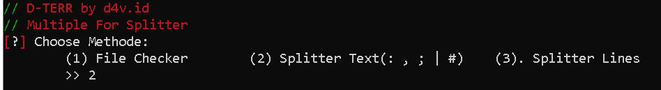
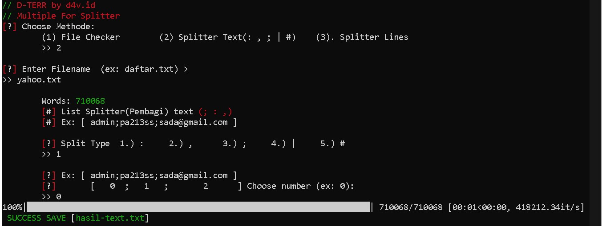
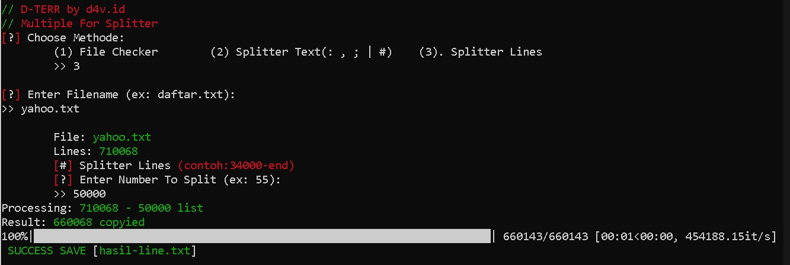

# // (D-TERR) Splitter-List-Line-Text 
<b>ENGLISH</b>
Multiple for Splitter file(List) is a line or character (; : , | #) until it becomes two files and can split of lines, sentences, and words that are in a file "List"

Fitur/Features:
- Split Line
- Split (; : , | #) Character
- Checker File Words,Sentences,lines



# Install
Pip **$**
```bash
 pip install colorama
 pip install tqdm
```

# Run
Python3 (Version)

# Images
Split Character (; : , | #)





Split Lines



# Support/Contact
d4vbusiness@gmail.com (Gmail)
